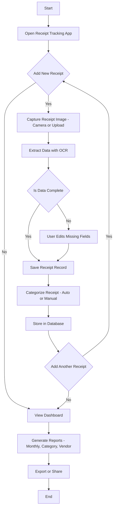

```mermaid
flowchart TD;
    A[Start] --> B[Open Receipt Tracking App];
    B --> C{Add New Receipt};
    C -->|Yes| D[Capture Receipt Image - Camera or Upload];
    C -->|No| L[View Dashboard];
    D --> E[Extract Data with OCR];
    E --> F{Is Data Complete};
    F -->|No| G[User Edits Missing Fields];
    F -->|Yes| H[Save Receipt Record];
    G --> H;
    H --> I[Categorize Receipt - Auto or Manual];
    I --> J[Store in Database];
    J --> K{Add Another Receipt};
    K -->|Yes| C;
    K -->|No| L[View Dashboard];
    L --> M[Generate Reports - Monthly, Category, Vendor];
    M --> N[Export or Share];
    N --> O[End];
```
